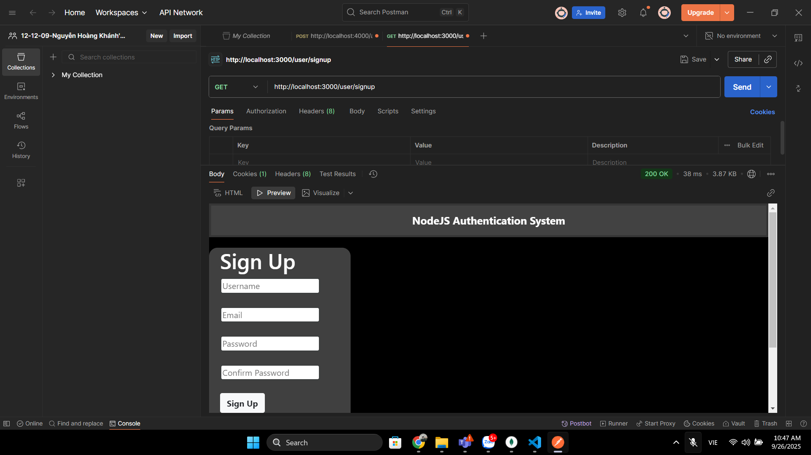
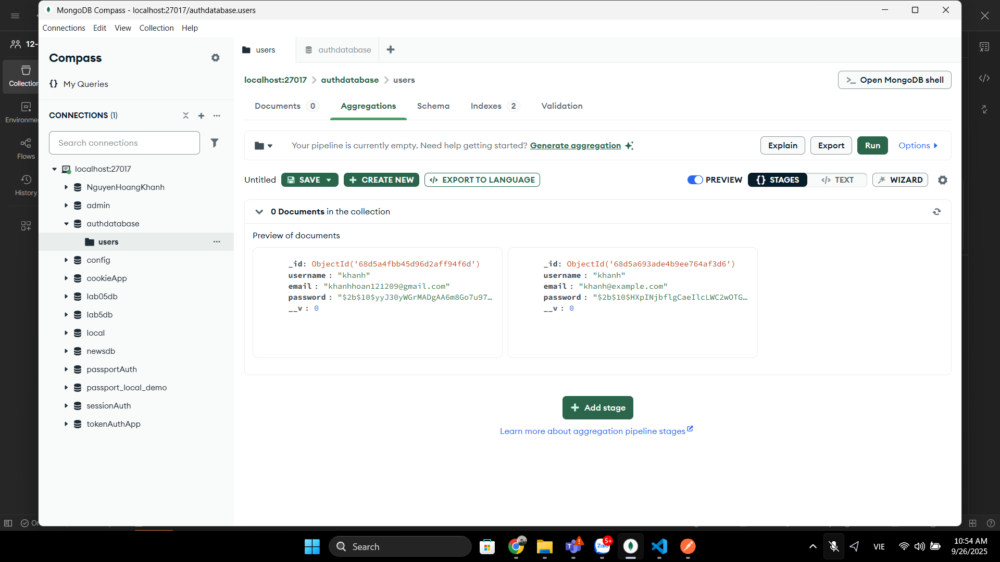
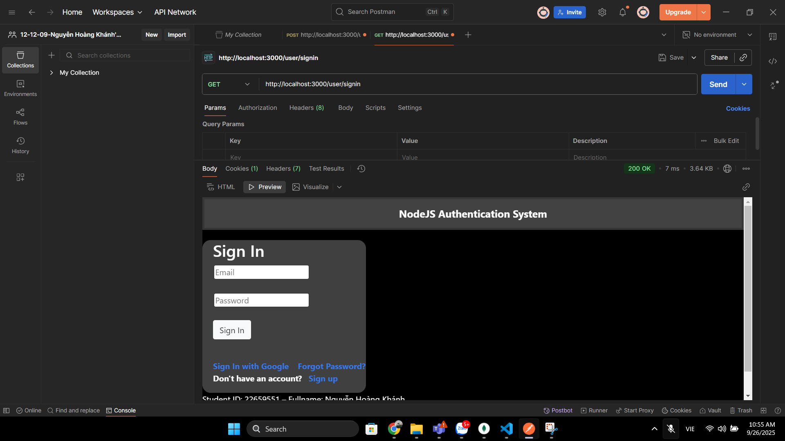
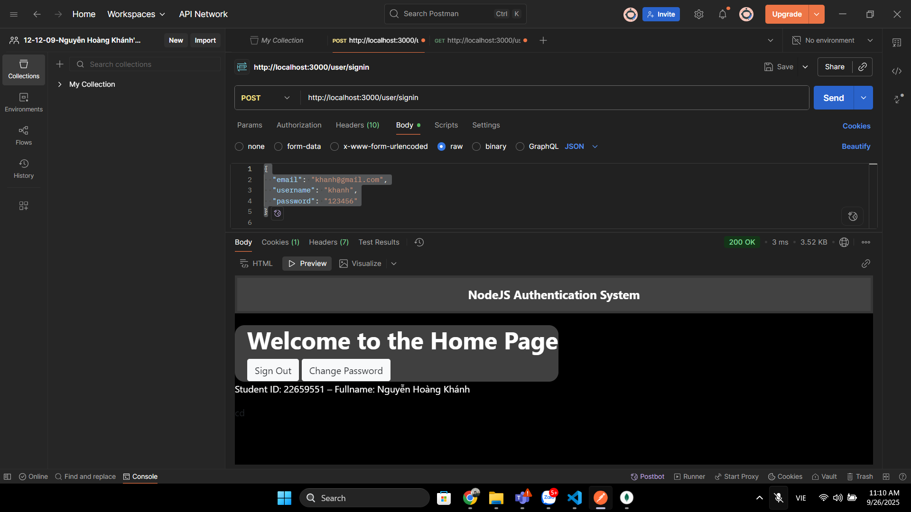
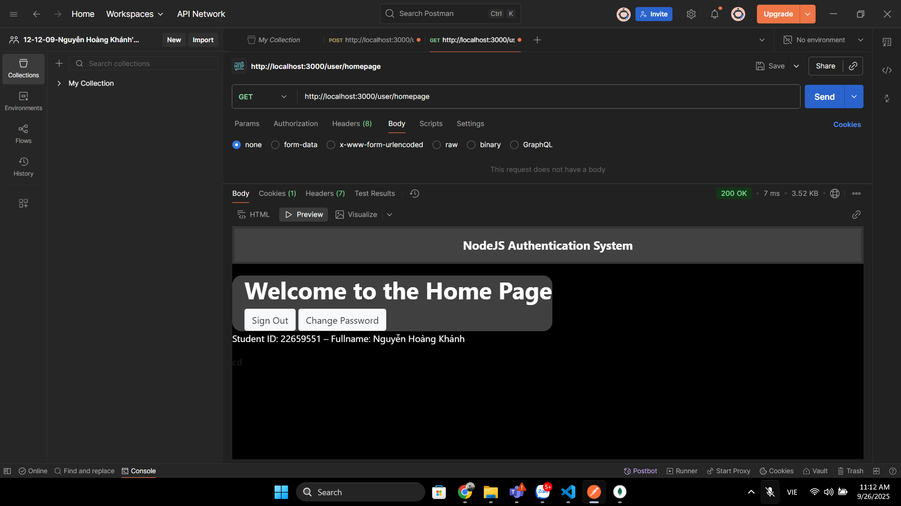
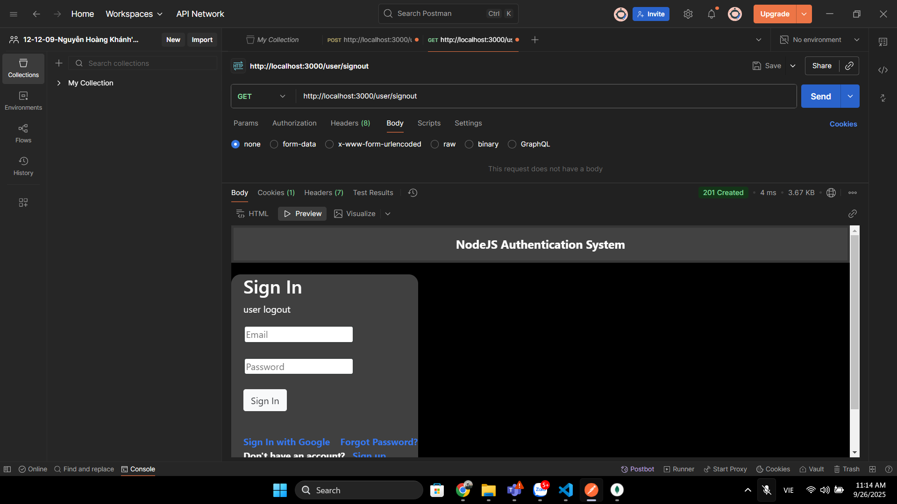
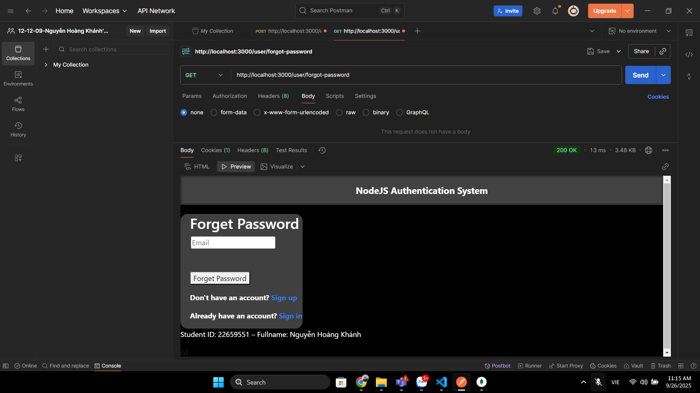
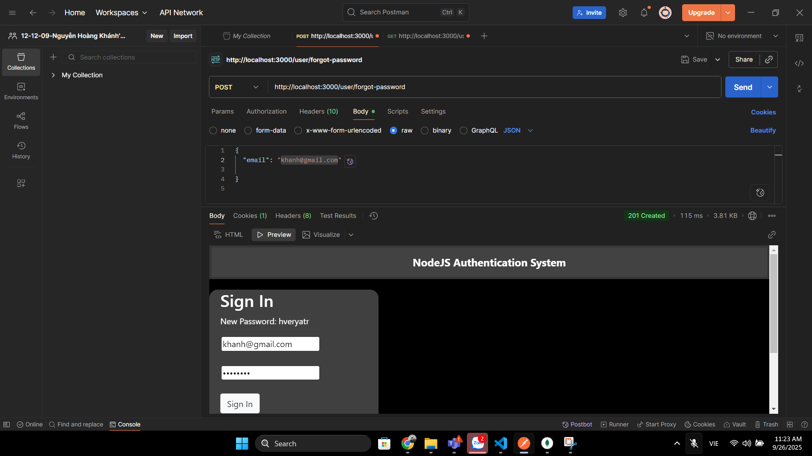
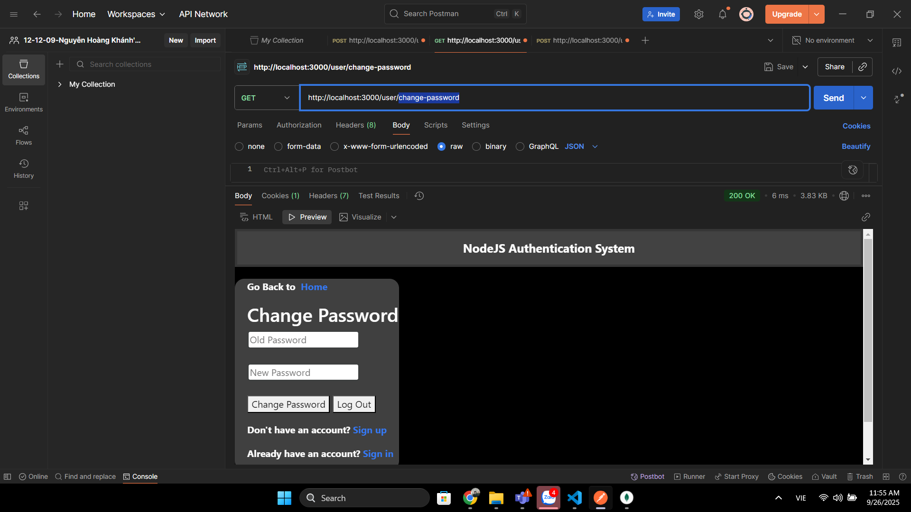
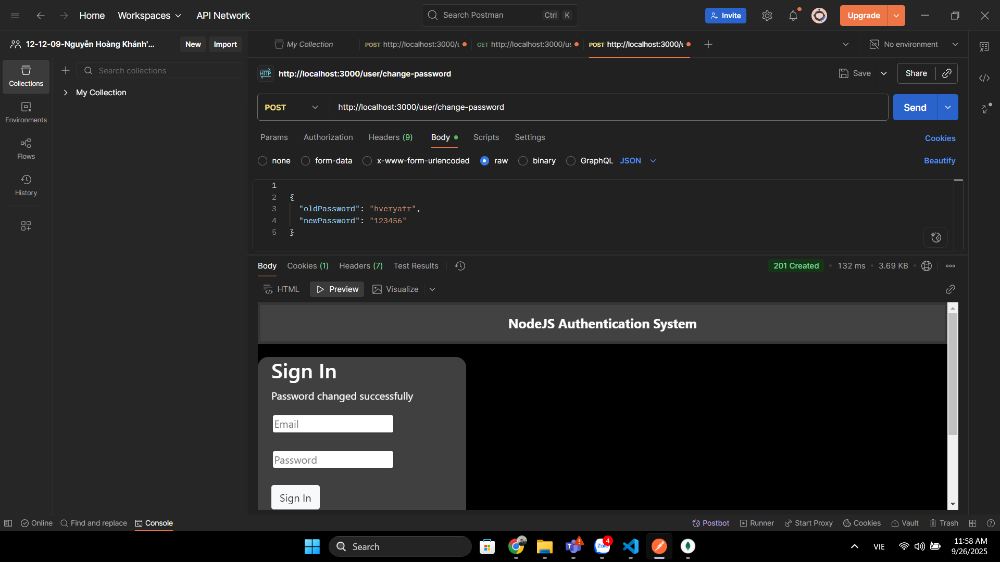

# Node.js Authentication System

This project contains a complete authentication system using Node.js, Express, and MongoDB. It includes features like sign up, sign in, sign out, password reset, and social authentication (Google). The project is structured to be scalable with separate components for models, controllers, and routes.

## Live Site
[Click here](https://nodejs-authentication-system-l2pu.onrender.com/user/signin) to visit the live site.

## Features Implemented
- **Sign-up with Email**: Create an account using your email and password.
- **Sign-in**: Log into your account securely.
- **Sign Out**: Log out of your session.
- **Reset Password**: You can reset your passwords after signing in.
- **Encrypted Passwords**: Passwords are securely stored using encryption.
- **Google Login/Signup**: Sign in or sign up using your Google account.
- **Forgot Password**: Reset your password via email.
- **Password Strength Validation**: Notifications are displayed for unmatching passwords during sign up and incorrect passwords during sign in.
- **reCAPTCHA Integration**: Protects against bot traffic on sign up and login pages.

## Environment Variables

Before running the application locally, ensure you have set up the following environment variables in a .env file located at the root of your project:

1. **PORT**: Specifies the port number the application listens on.
2. **DB_URL**: MongoDB database connection URL.
3. **CLIENT_ID**: Google OAuth client ID.
4. **CLIENT_SECRET**: Google OAuth client secret (sign in with Google).
5. **EMAIL**: Email address for sending emails.
6. **PASSWORD**: App-specific password or regular password for the Gmail account.
7. **RECAPTCHA_SECRET_KEY**: Google reCAPTCHA secret key.
8. **CLIENT_URL**: URL to redirect after signing in with Google, e.g., "http://localhost:3000/auth/login/success".

Ensure that you have the appropriate values for each variable before running the application.

Example `.env` file:

```plaintext
PORT=3000
DB_URL=mongodb://localhost:27017/authdatabase
CLIENT_ID=your_client_id
CLIENT_SECRET=your_client_secret
EMAIL=your_email@gmail.com
PASSWORD=your_gmail_password
RECAPTCHA_SECRET_KEY=your_recaptcha_secret_key
CLIENT_URL=http://localhost:3000/auth/login/success
```

## Folder
  ```csharp
node-authentication/
├── config/                  # Configuration files
│   └── mongodb.js           # MongoDB configuration
│
├── controllers/             # Controller logic
├── models/                  # Database models
├── routes/                  # Route definitions
├── views/                   # EJS views
├── app.js                   # Express application setup
│
├── public/                  # Static assets
│
├── package.json             # NPM package configuration
├── README.md                # Project README file
├── .gitignore               # Git ignore configuration
└── .env                     # Environment variables file

```

## Installation and Setup

Follow these steps to run the project locally:


1. Clone the repository to your local machine:

   ```bash
   git clone https://github.com/your-username/nodejs-authentication-system.git
  
2. Navigate into the project directory:
   ```bash
   cd node-authentication-system
    ```
3. Install dependencies:
   ```bash
   npm install

4. Start the server:
   ```bash
   npm start
5. Open your web browser and visit http://localhost:3000 to access the application.

## Dependencies required

- Express.js
- MongoDB
- Passport.js
- bcrypt
- express-session
- express-ejs-layouts
- dotenv
- nodemailer

## Credits

This project was created by [Ravikant Singh](https://github.com/ravikantsingh12). Contributions via issues or pull requests are welcome!

## Follow me on

- [LinkedIn](https://www.linkedin.com/in/ravikant-singh-327a98241)
----------------------------------------------------------------------------------------------------------------


## 📌 README.md cho Requirement 6 (Local Auth only)

````markdown
# NodeJS Authentication System (Local Auth)

Dự án này minh họa hệ thống xác thực người dùng bằng **Local Authentication** với Node.js, Express, MongoDB và Passport.  
Người dùng có thể đăng ký, đăng nhập, đăng xuất, đổi mật khẩu, quên mật khẩu và truy cập trang cá nhân.

---

## 1. Cài đặt

Cài các thư viện cần thiết:
```bash
npm install
````

Tạo file `.env` ở gốc project:

```env
PORT=3000
DB_URL=mongodb://localhost:27017/authdatabase
```

Chạy MongoDB trên máy, sau đó start server:

```bash
npm start
```

Server chạy tại: [http://localhost:3000](http://localhost:3000)

---

## 2. Các chức năng chính

### 2.1. Đăng ký (Sign Up)

* **GET** [http://localhost:3000/user/signup](http://localhost:3000/user/signup) → hiển thị form đăng ký
* **POST** [http://localhost:3000/user/signup](http://localhost:3000/user/signup) → gửi dữ liệu đăng ký

Body (form-data hoặc JSON):

```json
{
  "email": "khanh@gmail.com",
  "username": "khanh",
  "password": "123456"
}
```

**Kết quả mong đợi:**

* Người dùng mới được lưu vào MongoDB
* Response: User registered successfully
* Ảnh test: public/results/signup1.png




---

### 2.2. Đăng nhập (Sign In)

* **GET** [http://localhost:3000/user/signin](http://localhost:3000/user/signin) → hiển thị form đăng nhập
* **POST** [http://localhost:3000/user/signin](http://localhost:3000/user/signin) → gửi dữ liệu đăng nhập

Body:

```json
{
  "email": "khanh@gmail.com",
  "username": "khanh",
  "password": "123456"
}
```

**Kết quả mong đợi:**

* Nếu đúng thông tin → login thành công, chuyển hướng tới homepage
* Nếu sai → báo lỗi
* Ảnh test: `public/results/signin.png`



---

### 2.3. Trang chính (Homepage / Dashboard)

* **GET** [http://localhost:3000/user/homepage](http://localhost:3000/user/homepage)

**Kết quả mong đợi:**

* Chỉ vào được khi đã đăng nhập
* Hiển thị “Welcome” kèm Student ID + Fullname
* Ảnh test: `public/results/homepage.png`

---

### 2.4. Đăng xuất (Sign Out)

* **GET** [http://localhost:3000/user/signout](http://localhost:3000/user/signout)

**Kết quả mong đợi:**

* Xóa session
* Trở về trang signin
* Ảnh test: `public/results/signout.png`

---

### 2.5. Quên mật khẩu (Forgot Password)

* **GET** [http://localhost:3000/user/forgot-password](http://localhost:3000/user/forgot-password)
* **POST** [http://localhost:3000/user/forgot-password](http://localhost:3000/user/forgot-password)
{
  "email": "khanh@gmail.com"
 
}
**Kết quả mong đợi:**

* Hiện form nhập email
* Gửi request sẽ hiển thị thông báo xử lý (giả lập)
* Ảnh test: `public/results/forgot-password.png`



---

### 2.6. Đổi mật khẩu (Change Password)

* **GET** [http://localhost:3000/user/change-password](http://localhost:3000/user/change-password)
* **POST** [http://localhost:3000/user/change-password](http://localhost:3000/user/change-password)

**Kết quả mong đợi:**

* Hiện form đổi mật khẩu
* Sau khi submit → mật khẩu user được cập nhật trong DB
* Ảnh test: `public/results/change-password.png`



---


